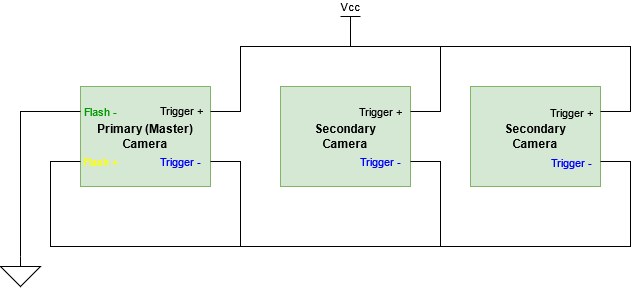
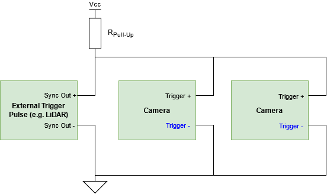

# peak_cam

A Linux [ROS C++ Node](https://wiki.ros.org/peak_cam) that wraps the driver API for IDS vision cameras using IDS peak software. Tested on Ubuntu 18.04 LTS and 20.04 LTS.

## How to run

### Before running the code

1. install [ROS](http://wiki.ros.org/ROS/Installation)
2. install [IDS peak](https://de.ids-imaging.com/download-vision-lin64.html)

### Running the code

0. Clone the repository to your Linux computer

1. Generate a ROS workspace

    `$ mkdir -p camera_ws/src/` 

1. Copy the peak_cam package into your ROS workspace and build it
    
    `$ cp -r peak_cam/ camera_ws/src/`
    
    `$ cd camera_ws/ && catkin_make && source devel/setup.bash`

2. Set parameters such as ROS topic and acquisition rate under `launch/params/peak_cam_params.yaml`

3. Plug the IDS vision camera and launch the node 

    `$ roslaunch peak_cam peak_cam_node.launch`
    
4. Stop the node with `Ctrl-C` (SIGINT) for controlled shutdown 

For multiple cameras, create a `.launch` and a `.yaml` file for each camera.

> Hint: Sometimes the cameras are only accesible as root. Try ` sudo -s` in your terminal and launch the node again.

### Triggering for stereo vision
To synchronously acquire images from two cameras in a stereo vision setup, you might want to let one camera trigger the other. 

1. Setup the GPIO wiring [as proposed by IDS](https://en.ids-imaging.com/application-notes-details/app-note-synchronizing-image-acquisition.html) according to the pin layout found in your camera's datasheet (example color coding for GV-5270FA):

    

1. Configure the primary (master) camera's `.yaml` file with
    ```
    Line1Source: "ExposureActive"
    TriggerSource: "Off"
    ```
    and the secondary camera's `.yaml` with
    ```
    Line1Source: "Off"
    TriggerSource: "Line0"
    ```

### Trigger using external pulses
The cameras can also be triggered by the pulses of external devices such as a lidar sensor.

1. (Activate the trigger output of your external device, e.g., using the `multipurpose_io_mode` flag for Ouster lidars as discussed in [section 5.2.2 of their software user manual](https://data.ouster.io/downloads/software-user-manual/software-user-manual-v2.1.0.pdf#35))
1. Setup the GPIO wiring in compliance to your hardware, e.g., with an optoisolated open collector sync pulse circuit:
    
    

1. Configure your camera's `.yaml` files with
    ```
    Line1Source: "Off"
    TriggerSource: "Line0"
    ```

Copyright (c) 2020, Sherif Nekkah and Contributors 

All rights reserved.

BSD license: see LICENSE file
